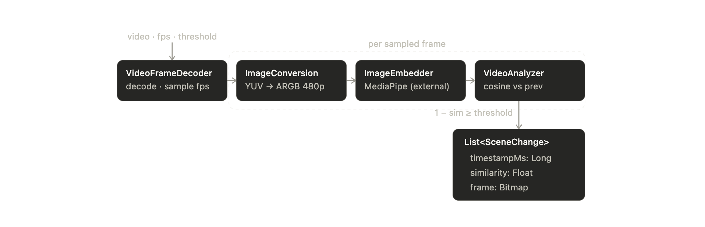
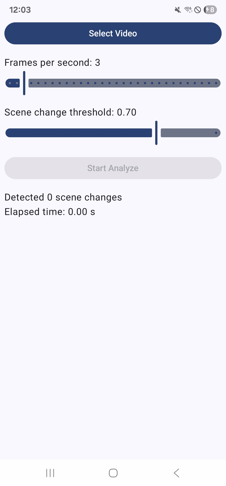
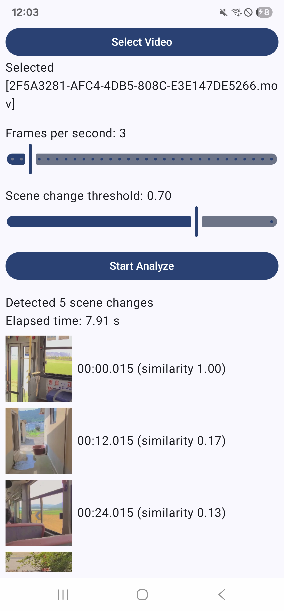

# Video Frame Analyzer

Simple video frame analyzer using Google's [Mediapipe Image Embedding](https://developers.google.com/edge/mediapipe/solutions/vision/image_embedder/android).

Detects scene change point per frame, with timestamp info.

## Project Overview

> This diagram is generated with Claude



## Get Started

1. Clone this repository on your local environment
   ```bash
   yong@ubuntu-server ~/ :$ git clone https://github.com/yymin1022/VideoFrameAnalyzer.git
   ```
2. Build APK with gradle, and install to your own device
   ```bash
   yong@ubuntu-server ~/ :$ cd VideoFrameAnalyzer
   yong@ubuntu-server ~/VideoFrameAnalyzer/ :$ ./gradlew assembleDebug
   yong@ubuntu-server ~/VideoFrameAnalyzer/ :$ adb install app/build/outputs/apk/app-debug.apk
   ```

## Screenshots

<p align="left">
  
  
</p>

## Useful links

- [Official sample project](https://github.com/google-ai-edge/mediapipe-samples/tree/main/examples/image_embedder/android)
- [Official guide](https://developers.google.com/edge/mediapipe/solutions/vision/image_embedder/android)
